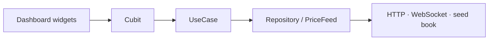

# Agent guide — mindorigin

**mindorigin** — Mini Investment Portfolio Dashboard with Live WebSocket Data.

Consult this file with **[CLAUDE.md](CLAUDE.md)** and **[DESIGN.md](DESIGN.md)** before changing code.

Package: `com.example.mindorigin`. Flutter **3.41+** / Dart **≥ 3.5**. Android and iOS.

---

## Project

Single dashboard for a mock NSE book plus a live tape. Search, sort, scroll, and an in-progress target-alert draft must stay put while ticks arrive.

| Surface | Behavior |
| ------- | -------- |
| Header | App name, today’s date, connection chip, theme toggle, **Kill socket** on dev |
| Ticker tape | Per-symbol last price and change %; only the chip that moved rebuilds |
| Summary cards | Invested, current value, P/L (₹ and %), today’s change — **computed**, never cached |
| Filters | All, Invested, Profits (+), Losses (-), Today's change — membership is **pinned** |
| Chart | 1d–10d performance area chart (`fl_chart`); historical NAV, not live ticks |
| Holdings | Search, pinned sort, live LTP, P/L, inline target-price alert |

Holdings book: RELIANCE, TCS, HDFCBANK, INFY, ZOMATO. Tape extras: NIFTY 50, SENSEX, TATAMOTORS, ITC. Indian UI names stay in every flavor.

**Dev / QA** use `SimulatedPriceFeed`. **Prod** takes a Finnhub REST snapshot, then subscribes to `wss://ws.finnhub.io`. Flavors must change WebSocket URL, feed type, and backoff knobs — not only the app name or icon.

---

## Stack

| Area | Choice | Do not |
|------|--------|--------|
| Architecture | Feature First clean (`presentation` → `domain` → `data`) | Cross-feature internals, domain importing Flutter UI |
| State | **Cubit** (`flutter_bloc`) + `context.watch` / `context.select` | Event `Bloc`, `BlocBuilder`, `BlocProvider.of` |
| Navigation | Imperative `AppRouter` / `Navigator` | A second router (go_router, auto_route) |
| Backend | None. Mock book + Finnhub / simulated feed | Hive, a custom API, a second HTTP client |
| HTTP | `dio` through `AppHttpClient` / `DioService` | `Dio()` in a widget or feed, `package:http` |
| Live feed | `web_socket_channel` inside `data/` | Sockets in domain or presentation |
| Persistence | `shared_preferences` via `StorageService` (theme only) | Persisting P/L, Hive |
| Theme | Material 3, dark-first Stitch navy / yield / loss | Hardcoded hex in widgets |
| Dark mode | `ThemeCubit` default **dark**, user toggle, persisted | “Follows system” as the only mode |
| ScreenUtil | `ScreenUtilWrapper` 360×690 | A second `ScreenUtilInit` |
| Localization | `easy_localization` (`en` only) | A second i18n library |
| Flutter Hooks | Disabled | Adding `flutter_hooks` |
| Env | `flutter_dotenv` — `.env.dev` / `.env.qa` / `.env.prod` | A real `FINNHUB_TOKEN` in git |
| Charts | `fl_chart` | A second chart library |
| Type | `google_fonts` — Plus Jakarta Sans + Inter | Painting Google Fonts default ink in dark mode |
| Results | `fpdart` / `equatable` | Caching derived P/L on a cubit |
| Firebase | `firebase_core` + `lib/firebase_options.dart` for App Distribution | Initializing Firebase in `bootstrap` unless requested |
| CI | GitHub Actions — `flutter analyze` + `flutter test` | Skipping tests |

Presentation never constructs `Dio()` or opens a socket. Hive is not part of the stack.

---

## Architecture (`clean`)

```text
lib/src/
├── bootstrap.dart              # platform launch — binding, env, splash, runApp
├── di/                         # AppScope + feature bindings (repos, feed, cubits)
├── flavors.dart                # WS_URL, FEED_TYPE, backoff knobs
├── features/
│   ├── portfolio/              # book, math, dashboard, chart, alerts
│   │   ├── presentation/
│   │   ├── domain/
│   │   └── data/
│   ├── market/                 # ticks, connection, feeds
│   │   ├── presentation/
│   │   ├── domain/
│   │   └── data/
│   └── theme/                  # ThemeCubit + SharedPreferences
├── routing/                    # AppRouter, AppRoutes (dashboard `/`)
├── config/                     # AppConfig, AppHttpClient, dotenv
├── services/                   # StorageService, DioService, InternetConnectionService
├── shared/                     # AppTopBar, SkeletonWrapper
├── theme/                      # ColorScheme, spacing, type
└── core/                       # connection labels, breakpoints, INR, backoff
```

**Rules**

- `domain/` is pure Dart — no Flutter UI, no `dio`, no `web_socket_channel`, no imports from `data/`.
- `data/` implements contracts from `domain/` — never the reverse.
- Entities are not models — no `fromJson` / `toJson` on domain entities.
- Use cases expose a single public `call()`.
- `presentation/` talks to use cases or cubits — not datasources.
- Features stay isolated. Shared types live under `lib/src/core/` or `lib/src/shared/`.
- Repositories and feeds are wired in `lib/src/di/app_scope.dart`. Do not construct feeds inside widgets. Do not add `get_it`.



---

## Features

### Portfolio

Owns the mock holdings book, derived math, summary cards, holdings list/table, target-price alerts, and the historical chart. Presentation talks to cubits and domain contracts only.

| Piece | File / type | Role |
| ----- | ----------- | ---- |
| `LoadHoldings` | `domain/usecases/load_holdings.dart` | Returns the mock book |
| `UpdateTargetAlert` | `domain/usecases/update_target_alert.dart` | Snapshot-and-diff write |
| `HoldingsRepository` | `load()`, `updateTargetAlert(ticker, value)` | In-memory seed book |
| `ChartRepository` | `series()` | 10-day NAV ledger, not live ticks |
| `PortfolioMath` | `domain/portfolio_math.dart` | P/L at read time |

Target alerts are **in-memory** on `HoldingsRepositoryImpl`. Do not add a server or SharedPreferences key for them unless requested.

### Market

Owns live ticks, quote snapshots, WebSocket / simulated feeds, and connection status. Domain only sees `PriceFeed`.

| Piece | Role |
| ----- | ---- |
| `WatchPrices` | Subscribe to tick + connection streams |
| `FetchQuoteSnapshot` | HTTP (or simulated) snapshot before (re)subscribe |
| `PriceFeed` | `ticks`, `connection`, `start`, `stop`, `killForDemo` |
| `createPriceFeed` | Flavor factory in `market/data/` |

### Theme

`ThemeCubit` + `ThemeRepository` + `StorageService`. Default mode is **dark**. The user toggle is persisted. Do not make the app system-only.

---

## State management (Cubit)

Prefer **Cubit** over event `Bloc`.

- States are immutable and `Equatable`. Prefer `const` constructors.
- In `build()`, use `context.watch` or `context.select`.
- Do not add `BlocBuilder`, `BlocConsumer`, or `BlocProvider.of`.
- Reconnect / offline copy is `ConnectionBanner`. Do not add `BlocListener` or a toast for feed status.
- Keep cubit methods thin — delegate to use cases, repositories, or the feed.
- Cubits are split so a tick cannot reset UI:

| Cubit | Owns | Must not emit on |
| ----- | ---- | ---------------- |
| `LivePricesCubit` | Coalesced ticker → tick | — |
| `ConnectionCubit` | `Live` / `Reconnecting…` / `Offline` | — |
| `HoldingsCubit` | Book + saved alerts | live ticks |
| `HoldingsUiCubit` | Search, pinned sort/filter, expanded row | live ticks |
| `TargetAlertEditCubit` | Snapshot-and-diff draft | live ticks |
| `ChartCubit` | Historical 1d–10d window | live ticks |
| `ThemeCubit` | Theme mode | live ticks |

```dart
// BAD — rebuilds every row on every tick
final prices = context.watch<LivePricesCubit>().state.ticks;

// GOOD — only RELIANCE rebuilds
final tick = context.select((LivePricesCubit c) => c.state.tickFor('RELIANCE'));
```

---

## Flavors and live feed

Do **not** use generic `lib/main.dart` as the flavor entry.

| Config | Flavor | Entry | Env | Feed |
| ------ | ------ | ----- | --- | ---- |
| `dev` | `Flavor.dev` | `lib/main_dev.dart` | `.env.dev` | Simulated, Kill socket, rebuild counters, short backoff |
| `beta` | `Flavor.qa` | `lib/main_qa.dart` | `.env.qa` | Simulated, different `WS_URL` / backoff, random drop/restore |
| `prod` | `Flavor.prod` | `lib/main_prod.dart` | `.env.prod` | Finnhub snapshot + WebSocket |

Prod token is `--dart-define=FINNHUB_TOKEN=...`. `.env.prod` may contain an empty `FINNHUB_TOKEN=` placeholder only.

On reconnect, refetch a quote snapshot, then resubscribe. Finnhub trades have no replay. Do not silently resume stale ticks.

Finnhub free plans return **403** for NSE symbols. The snapshot retries missing tickers with US fallbacks (`AAPL`, `MSFT`, …), then subscribes to whichever symbol succeeded. Indian UI names stay.

Backoff: 1s → 2s → 4s → 8s → 16s, cap from the flavor env (prod 30s), plus jitter. Connection chip text must be exactly `Live`, `Reconnecting…`, or `Offline` from `FeedConnectionStatus` / `ConnectionLabels`.

Dev: `feed.killForDemo()` demos reconnect without airplane mode.

---

## Derived metrics

P/L, P/L %, today’s change, invested, and current value are computed from holdings + latest ticks in `portfolio_math.dart`. Never cache them as cubit fields.

- Missing tick: `currentValue` falls back to `qty × avgBuy`.
- Today’s change is 0 when there is no real move — do not fabricate one from the fallback.
- `SummaryCards` must `select` the Equatable `PortfolioSummary`. Do not `select` a freshly allocated price `Map`.

---

## Selective rebuilds

A live tick must not reset search, sort, scroll, or an unsaved target-alert draft.

- Each `HoldingPriceCell` / `TickerChip` uses `context.select` for **one** ticker plus `RepaintBoundary` + `ValueKey(ticker)`.
- Sort and filter membership are pinned when the user chooses them.
- `ScrollController` lives on `HoldingsSection` state, not on a cubit.
- Target-alert save is snapshot-and-diff: skip the repository if the value is unchanged.
- Dev flavor increments `RebuildCounters` for Track Widget Rebuilds.

---

## Navigation

Single screen. `MaterialApp.home` is `DashboardPage`. Route `/` is `AppRoutes.dashboard`.

- Imperative navigation uses `AppRouter.onGenerateRoute` in `lib/src/routing/app_router.dart`.
- Register new screens in the central router — not ad hoc `MaterialPageRoute` factories in widgets.
- Use `Navigator` helpers from `context_extension.dart` / `global_navigator.dart`.

---

## Networking and services

- Quotes go through `AppHttpClient` → `DioService` → `AppConfig.dio`. Quote GETs set `allowClientError` so a Finnhub 403 is a response the feed can fallback from, not a thrown `DioException`.
- Never call `Dio()` inside a widget, screen, or feed.
- Map transport errors to `Failure` / `FutureEither` via `runTask()`. Do not leak raw `DioException` to UI.
- `runTask(..., requiresNetwork: true)` asks `InternetConnectionService` first.
- Active services: `StorageService`, `DioService`, `InternetConnectionService`. Do not re-add Auth, Copy, SecureStorage, or Permission helpers.
- Never pass `BuildContext` into services — use `rootContext` when UI is required.
- Logging: `AppLogger`. Connection copy is `ConnectionBanner`, not a dialog, snackbar, or toast.

---

## Conventions

- Primary import barrel: `package:mindorigin/src/imports/imports.dart` when already in that pattern.
- File names: `snake_case.dart`; classes: `PascalCase`; private members: `_camelCase`.
- Prefer `const` constructors; avoid `dynamic` without justification.
- No empty `catch` blocks — log, map to failure, or rethrow.
- Public APIs: `///` dartdoc. Prefer documenting *why* (reconnect snapshot, pinned sort).
- Money: Indian grouping via `formatInr` / `formatIndianNumber` (`14,85,200`).
- Connection copy and route names are named constants — no magic strings.
- Prefer `Row` / `Column` `spacing` and `AppSpacing` over magic numbers.
- One public class per file.

### Anti-patterns

- Business logic in widget `build()` except calling a pure domain function (`portfolio_math`).
- Direct network or feed calls from presentation widgets.
- Heavy logic inside cubit methods — delegate outward.
- `watch` of the full price map from the table or tape.
- A second state-management or routing library.

---

## How to add a new feature

1. Read `docs/flows/` for the feature / screen / data-flow first.
2. Create the domain entity and repository contract under `lib/src/features/<feature>/domain/`.
3. Add use case(s) in `domain/usecases/` (one public `call()`).
4. Add data model, datasource, and repository implementation under `data/`.
5. Wire a **Cubit** under `presentation/cubit/`.
6. Add `lib/src/di/<feature>_bindings.dart` and register it in `AppScope.create()`.
7. Build screens and widgets under `presentation/`. Use `context.watch` / `context.select`.
8. Register the route in `lib/src/routing/app_router.dart` if a new screen is needed.
9. Add tests under `test/features/<feature>/`.
10. Update `docs/flows/features/`, `docs/flows/component-flows/screens/`, and `docs/flows/data-flows/` in the same change.

---

## Safe to modify

| Path | Guidance |
|------|----------|
| `lib/src/features/**` | Feature screens, widgets, domain/data/presentation |
| `lib/src/shared/widgets/**` | Reusable UI |
| `lib/src/shared/helpers/**` | App-wide helpers |
| `lib/src/theme/**` | Tokens — add a token before a new hex |
| `test/**` | Unit and widget tests |
| `docs/flows/**` | Feature / screen / data-flow docs |
| `README.md` | Project documentation |

## Modify with caution

| Path | Why |
|------|-----|
| `lib/src/routing/app_router.dart` | Central navigation |
| `lib/src/bootstrap.dart` | Platform launch only |
| `lib/src/di/**` | Composition root — repos, feed, cubit providers |
| `lib/main_dev.dart` / `main_qa.dart` / `main_prod.dart` | Flavor entry points |
| `lib/src/config/app_config.dart` | Dio and HTTP setup |
| `lib/src/flavors.dart` | Feed type and backoff |
| `lib/src/imports/**` | Barrel exports |
| `pubspec.yaml` | Whole-app dependency graph |
| `android/`, `ios/` | Flavors, splash, Firebase — touch only when required |
| `.env.dev` / `.env.qa` / `.env.prod` | Placeholders only — never a real token |

## Do not commit

| Path | Why |
|------|-----|
| `.env` with a real `FINNHUB_TOKEN` | Secrets |
| `google-services.json`, `GoogleService-Info.plist`, keystores | Secrets |

Native folders may be edited for splash, flavors, or Firebase App Distribution. Avoid drive-by edits to `android/` / `ios/` / desktop.

---

## Verification after changes

```bash
flutter pub get
flutter analyze
flutter test
```

No `build_runner` step for this stack.

After editing `assets/translations/*.json`:

```bash
flutter pub run easy_localization:generate -S assets/translations -O lib/src/core/i18n -o locale_keys.g.dart
```

CI (`.github/workflows/ci.yml`) runs analyze + test on Flutter `3.41.x`.

---

## Hard limits

- Do not disable `flutter_lints` rules without an explanatory comment.
- Do not call networking or the feed from widgets.
- Do not commit production secrets.
- Do not introduce a second state-management or routing library.
- Do not cache P/L on a cubit.
- Do not silently resume a socket without a snapshot.
- For platform setup, use **[SETUP.md](SETUP.md)** and **[README.md](README.md)**.
- For UI tokens, use **[DESIGN.md](DESIGN.md)**.
- Keep **[CLAUDE.md](CLAUDE.md)** consistent with this file.
