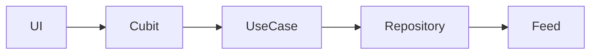

# Claude Code guide — mindorigin

Project brief for Claude Code. Prefer it alongside **[AGENTS.md](AGENTS.md)** (engineering rules) and **[DESIGN.md](DESIGN.md)** (UI tokens).

---

## Project

**mindorigin** — Mini Investment Portfolio Dashboard with live WebSocket (or simulated) prices.

Package: `com.example.mindorigin`. Flutter **3.41+** / Dart **≥ 3.5**. Android and iOS.

Single screen: header, live ticker tape, derived summary cards, filter chips, a 1d–10d performance chart, and holdings. Phone stacks. Tablet (≥ **840** logical px) splits summary/chart left and holdings right (table).

Search, sort, scroll, and an in-progress target-alert draft stay stable while ticks arrive.

Holdings: RELIANCE, TCS, HDFCBANK, INFY, ZOMATO. Tape extras: NIFTY 50, SENSEX, TATAMOTORS, ITC. Indian names stay in every flavor.

---

## Stack

| Area | Choice | Do not |
|------|--------|--------|
| Architecture | Feature First clean | — |
| State | **Cubit** + `context.watch` / `context.select` | Event `Bloc`, `BlocBuilder` |
| Navigation | Imperative `AppRouter` | A second router |
| Backend | None — mock book + Finnhub / simulated feed | Hive, a custom API |
| HTTP | `dio` via `AppHttpClient` | `Dio()` in widgets, `package:http` |
| Live feed | `web_socket_channel` in `market/data/` | Sockets in domain / UI |
| Persistence | SharedPreferences for **theme only** | Persisting P/L |
| Theme | Material 3, dark-first Stitch | “Follows system” as the only mode |
| Dark mode | `ThemeCubit` default **dark**, toggle, persist | Light-only Google Fonts ink |
| ScreenUtil | Already in `ScreenUtilWrapper` (360×690) | A second `ScreenUtilInit` |
| Localization | `easy_localization` (`en`) | — |
| Flutter Hooks | Disabled | Adding hooks |
| Env | `.env.dev` / `.env.qa` / `.env.prod` | A real Finnhub token in git |
| Charts | `fl_chart` | — |
| Type | Plus Jakarta Sans + Inter (`google_fonts`) | — |
| Firebase | `firebase_options.dart` for App Distribution | Calling `Firebase.initializeApp` in `bootstrap` unless requested |

---

## Architecture (`clean`)

```text
lib/src/
├── bootstrap.dart # platform launch
├── di/            # AppScope + feature bindings
├── flavors.dart
├── features/portfolio|market|theme/{presentation,domain,data}/
├── routing/
├── config/
├── services/
├── shared/
├── theme/
└── core/
```

**Rules**

- `domain/` is pure — no Flutter UI, no Dio, no WebSocket.
- `data/` implements domain contracts only.
- Entities have no `fromJson` / `toJson`.
- Use cases expose a single public `call()`.
- Presentation talks to cubits / use cases, never datasources.
- Features stay isolated. Shared types live in `lib/src/core/` or `lib/src/shared/`.
- Composition root is `lib/src/di/app_scope.dart` — construct feeds and repos there, not in widgets. Do not add `get_it`. `bootstrap.dart` is platform launch only.



---

## State management (Cubit)

Cubits are split so a price tick cannot reset UI. Do not add one event `Bloc` per feature.

| Cubit | Owns | Must not emit on a tick |
| ----- | ---- | ----------------------- |
| `LivePricesCubit` | Coalesced ticks | — |
| `ConnectionCubit` | `Live` / `Reconnecting…` / `Offline` | — |
| `HoldingsCubit` | Book + saved alerts | yes |
| `HoldingsUiCubit` | Search, pinned sort/filter, expand | yes |
| `TargetAlertEditCubit` | Draft vs snapshot | yes |
| `ChartCubit` | Historical 1d–10d window | yes |
| `ThemeCubit` | Theme mode | yes |

In `build()`, use `context.watch` / `context.select`. Do not add `BlocBuilder` or `BlocProvider.of`. Reconnect / offline copy is `ConnectionBanner`.

Each tape chip and holdings price cell selects **one** ticker:

```dart
final tick = context.select((LivePricesCubit c) => c.state.tickFor(ticker));
```

Wrap rows in `RepaintBoundary` + `ValueKey(ticker)`.

---

## Flavors and live feed

| Flavor | Entry | Env | Feed |
| ------ | ----- | --- | ---- |
| Dev | `lib/main_dev.dart` | `.env.dev` | Simulated, Kill socket, rebuild counters |
| QA (`beta` run config) | `lib/main_qa.dart` | `.env.qa` | Simulated, different WS URL / backoff |
| Prod | `lib/main_prod.dart` | `.env.prod` | Finnhub snapshot + `wss://ws.finnhub.io` |

Do not use generic `lib/main.dart` as the flavor. Flavors must change `WS_URL`, `FEED_TYPE`, and backoff — not only the app name.

On reconnect: snapshot, then resubscribe. Do not silently resume stale ticks.

Finnhub free plans **403** NSE symbols. Retry missing tickers with US fallbacks, then subscribe to what succeeded. UI names stay Indian.

Connection chip copy is exactly `Live`, `Reconnecting…`, `Offline`.

Prod token: `--dart-define=FINNHUB_TOKEN=...`. Never commit a real token.

---

## Derived metrics

Invested, current value, P/L, P/L %, and today’s change are computed in `lib/src/features/portfolio/domain/portfolio_math.dart` from the book + latest ticks. Never store those numbers on a cubit.

`SummaryCards` selects the Equatable `PortfolioSummary`. Do not select a new `Map` of prices (identity equality would rebuild the grid on every tape tick).

Missing tick: value falls back to `qty × avgBuy`. Do not invent a “today’s change” from that fallback.

Target-alert save is snapshot-and-diff. Skip the repository if the value is unchanged. Alerts live in memory on `HoldingsRepositoryImpl`.

Chart series is a 10-day NAV ledger — not live ticks. Ranges: 1d, 3d, 5d, 7d, 10d.

---

## Navigation, HTTP, and services

- Single route: `/` → `DashboardPage` (`AppRoutes.dashboard`). Register new screens in `AppRouter`.
- Quotes: `AppHttpClient` → `DioService` → `AppConfig.dio`. Allow client errors so a 403 can fall back.
- `web_socket_channel` stays inside `market/data/`.
- Active services: `StorageService`, `DioService`, `InternetConnectionService`. Do not re-add Auth / clipboard / secure-storage / permission helpers.
- Never pass `BuildContext` into services. Use `rootContext` when UI is required.
- Logging: `AppLogger`. Connection copy is `ConnectionBanner`.

---

## UI

Consult **[DESIGN.md](DESIGN.md)** before restyling. Atmosphere: institutional, dark-first Indian-market terminal.

- Tokens: `AppSpacing`, `AppBorders`, `AppDurations` (`priceFlash` 320ms), `AppCurves`.
- Yield / loss: `context.appColors.yield` / `loss`. Surfaces: `context.colors`.
- Tabular figures on rupees and percents. Indian grouping via `formatInr`.
- Phone: cards. Tablet: holdings table. Breakpoint **840**.
- Price flash 260–400ms on **only** the cell that changed.
- Copy lives in `assets/translations/en.json`.

---

## How to add a feature

1. Read `docs/flows/` first (`features/`, `component-flows/screens/`, `data-flows/`).
2. Domain → use cases → data → Cubit → `lib/src/di/<feature>_bindings.dart` → widgets.
3. Tests under `test/features/<feature>/`.
4. Update the matching flow docs in the same change.
5. Run `flutter analyze` and `flutter test`.

No `build_runner`. After translation edits:

```bash
flutter pub run easy_localization:generate -S assets/translations -O lib/src/core/i18n -o locale_keys.g.dart
```

---

## Safe to modify

| Path | Guidance |
|------|----------|
| `lib/src/features/**` | Feature screens, widgets, domain/data/presentation |
| `lib/src/shared/**` | Reusable UI and helpers |
| `lib/src/theme/**` | Tokens — add a token before a new hex |
| `test/**` | Unit and widget tests |
| `docs/flows/**` | Feature / screen / data-flow docs |
| `README.md` | Project documentation |

## Modify with caution

`bootstrap.dart`, `lib/src/di/`, flavor entry points, `app_config.dart`, `flavors.dart`, `app_router.dart`, `pubspec.yaml`, native folders (splash / flavors / Firebase only when required).

## Do not commit

A real `FINNHUB_TOKEN`, `google-services.json`, `GoogleService-Info.plist`, keystores.

---

## Hard limits

- Cubit + `watch` / `select`. No `BlocBuilder`.
- No P/L cached on a cubit.
- No silent socket resume.
- No second state-management or routing library.
- No networking from widgets.
- Do not disable `flutter_lints` without a comment.
- Keep this file consistent with **[AGENTS.md](AGENTS.md)**.
