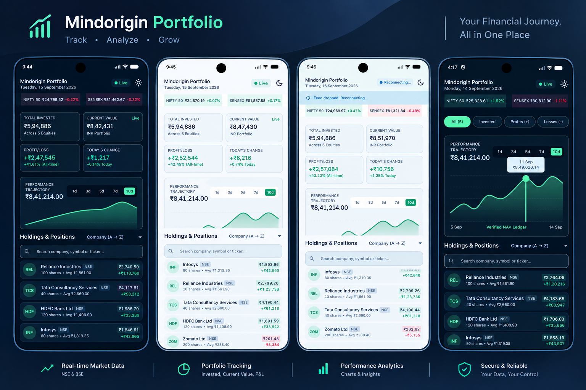
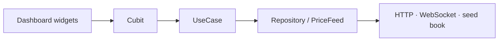
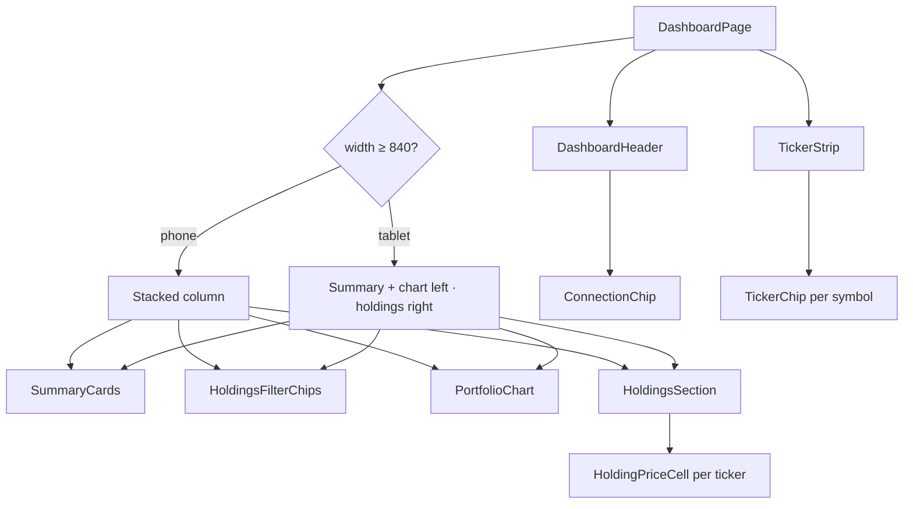
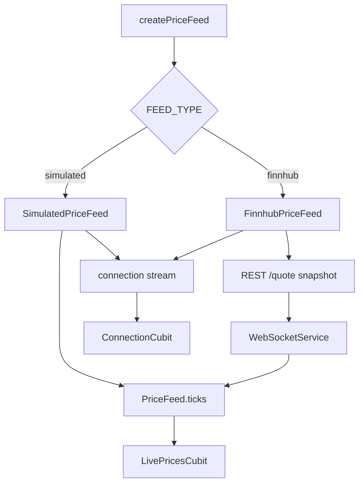

# Mindorigin Portfolio

Mini investment portfolio dashboard with a live price feed. Built so search, sort, scroll, and an in-progress target-alert draft stay put while ticks arrive underneath the user.

Package: `com.example.mindorigin` · Flutter 3.41+ / Dart 3.5+ · Android and iOS

## Overview

The app is a single dashboard for a mock NSE book (RELIANCE, TCS, HDFCBANK, INFY, ZOMATO) plus tape extras (NIFTY 50, SENSEX, TATAMOTORS, ITC).

| Surface | What it does |
| ------- | ------------ |
| Header | App name, today’s date, connection chip (`Live` / `Reconnecting…` / `Offline`), theme toggle, **Kill socket** on dev |
| Ticker tape | Per-symbol last price and change %; only the chip that moved rebuilds |
| Summary cards | Invested, current value, P/L (₹ and %), today’s change — **computed**, never cached |
| Filters | All, large-book, profit, loss, today’s movers |
| Chart | 1d–10d performance area chart (`fl_chart`) with date + value tooltip |
| Holdings | Search, pinned sort, live LTP, P/L, inline target-price alert |

**Dev / QA** drive a simulated random-walk feed. **Prod** takes a Finnhub REST snapshot, then subscribes to `wss://ws.finnhub.io`. Flavors change WebSocket URL, feed type, and backoff knobs — not only the app name.

## Screenshot




## Libraries used

| Area | Choice |
| ---- | ------ |
| UI | Flutter, Material 3, dark-first Stitch navy / yield / loss palette |
| Architecture | Feature First clean architecture (`presentation` → `domain` → `data`) |
| State | Cubit (`flutter_bloc`) + `context.watch` / `context.select` |
| Navigation | Imperative `AppRouter` / `Navigator` |
| HTTP | `dio` through `AppHttpClient` (quote snapshots) |
| Live feed | `web_socket_channel` (Finnhub trades) or `SimulatedPriceFeed` |
| Persistence | `shared_preferences` (theme) |
| Charts | `fl_chart` |
| Typography | `google_fonts` — Plus Jakarta Sans + Inter |
| i18n | `easy_localization` (en) |
| Layout | `flutter_screenutil` + `LayoutBuilder` |
| Results | `fpdart` / `equatable` |
| Env | `flutter_dotenv` (`.env.dev` / `.env.qa` / `.env.prod`) |
| CI | GitHub Actions — `flutter analyze` + `flutter test` |

No second state-management or routing library. Presentation never constructs `Dio()` or opens a socket.

## Architecture

### Layer flow



- **presentation** — screens, widgets, Cubits. Talks to use cases and domain contracts only.
- **domain** — pure Dart entities, repository interfaces, use cases. No Flutter, Dio, or `web_socket_channel`.
- **data** — repository impls, Finnhub / simulated feeds, quote datasource.

Features stay isolated: `portfolio` owns the book and math, `market` owns ticks and connection, `theme` owns light/dark persistence. Shared types live under `lib/src/core/` and `lib/src/shared/`.

### Feature skeleton

```text
lib/src/
├── bootstrap.dart              # platform launch
├── di/                         # AppScope + feature bindings
├── flavors.dart                # WS_URL, FEED_TYPE, backoff knobs
├── features/
│   ├── portfolio/
│   │   ├── presentation/       # DashboardPage, summary, chart, holdings
│   │   ├── domain/             # Holding, portfolio_math, use cases
│   │   └── data/               # seed book, holdings + chart repos
│   ├── market/
│   │   ├── presentation/       # LivePricesCubit, ConnectionCubit, tape
│   │   ├── domain/             # PriceTick, PriceFeed, watch / snapshot
│   │   └── data/               # Simulated + Finnhub feeds, WebSocketService
│   └── theme/
├── routing/                    # AppRouter, AppRoutes
├── config/                     # AppHttpClient, dotenv
├── services/                   # StorageService, Dio singleton
├── shared/                     # AppTopBar, SkeletonWrapper
└── theme/                      # ColorScheme, spacing, typography
```

### Screen skeleton



`SkeletonWrapper` covers the scaffold until `HoldingsCubit` reports `loaded`.

### Cubits (split so a tick cannot reset UI)

| Cubit | Owns | Must not emit on |
| ----- | ---- | ---------------- |
| `LivePricesCubit` | Coalesced ticker → tick | — |
| `ConnectionCubit` | `Live` / `Reconnecting…` / `Offline` | — |
| `HoldingsCubit` | Book + saved alerts | live ticks |
| `HoldingsUiCubit` | Search, pinned sort/filter, expanded row | live ticks |
| `TargetAlertEditCubit` | Snapshot-and-diff draft | live ticks |
| `ChartCubit` | Historical 1d–10d window | live ticks |
| `ThemeCubit` | Theme mode | live ticks |

Each `HoldingPriceCell` / `TickerChip` uses `context.select((LivePricesCubit c) => c.state.tickFor(ticker))` plus `RepaintBoundary` + `ValueKey(ticker)`.

### Live feed



On reconnect the feed **refetches a snapshot, then resubscribes**. Finnhub trades have no replay; silently resuming the old socket would show stale mid-gap prices.

## Setup

### Prerequisites

- [Flutter](https://docs.flutter.dev/get-started/install) **3.41.x** (CI pin) or current stable with **Dart ≥ 3.5**
- Xcode (iOS) or Android Studio / SDK (Android API 21+)
- A device or emulator (`flutter devices`)
- Optional for **prod**: a [Finnhub](https://finnhub.io) API token — never commit it

```bash
flutter doctor
```

### Installation

1. Clone and fetch packages:

   ```bash
   git clone <repo-url>
   cd mindorigin
   flutter pub get
   ```

2. Flavor env files (`.env.dev`, `.env.qa`, `.env.prod`) are already in the repo. They set `WS_URL`, `FEED_TYPE`, and backoff. `.env.prod` has an empty `FINNHUB_TOKEN=` placeholder only.

   On iOS, native plugins resolve via Swift Package Manager when you run `flutter pub get` or `flutter run`.

3. Run a flavor:

   ```bash
   flutter run -t lib/main_dev.dart
   flutter run -t lib/main_qa.dart
   flutter run -t lib/main.dart --dart-define=FINNHUB_TOKEN=your_token
   ```

   In Cursor / VS Code / IntelliJ pick **dev**, **beta**, or **prod**. Use **dev (profile)** / **beta (profile)** / **prod (profile)** when you care about FPS and jank.

| Config | Flavor | Entry | Env | Feed |
| ------ | ------ | ----- | --- | ---- |
| `dev` | `Flavor.dev` | `lib/main_dev.dart` | `.env.dev` | Simulated ticks, Kill socket, rebuild counters, short backoff |
| `beta` | `Flavor.qa` | `lib/main_qa.dart` | `.env.qa` | Simulated ticks, different `WS_URL` / backoff, random drop/restore |
| `prod` | `Flavor.prod` | `lib/main_prod.dart` | `.env.prod` | Finnhub snapshot + WebSocket |

Prod reads the token from `--dart-define=FINNHUB_TOKEN=...` (or the IDE env). Do **not** put a real token in `.env.prod`.

4. Verify:

   ```bash
   flutter analyze
   flutter test
   ```

## WebSocket notes

- **Dev / QA:** `SimulatedPriceFeed` random-walks the mock NSE book and can drop/restore the stream.
- **Prod:** Finnhub REST `/quote` snapshot, then `wss://ws.finnhub.io` trade subscribe.
- Indian UI names stay (RELIANCE, TCS, …). Finnhub first tries `RELIANCE.NS` etc. If quotes fail, it falls back to a documented US map (`AAPL`, `MSFT`, …) because free Finnhub trade sockets are unreliable for NSE.

## Reconnect / backoff

`WebSocketService` (and the simulated feed) uses exponential backoff: 1s → 2s → 4s → 8s → 16s, cap from the flavor env (prod 30s), plus jitter so clients do not reconnect in lockstep.

On disconnect the chip shows **Reconnecting…**. Before a new socket opens, the feed **refetches a quote snapshot**, then resubscribes. Finnhub trades are a live firehose with **no replay** — silently resuming the old socket would show stale mid-gap prices. Snapshot-then-subscribe is the recovery path.

To demo it: run **dev**, tap **Kill socket** (or enable airplane mode). The chip and banner go `Reconnecting…`, then `Live` after snapshot + resubscribe.

## Preventing unnecessary rebuilds

A live tick must not rebuild the whole dashboard or reset search, sort, scroll, or an unsaved target-alert draft.

- Cubits are split: `LivePricesCubit` owns ticks; `HoldingsUiCubit`, `TargetAlertEditCubit`, and `ChartCubit` never emit because of a price change.
- Holdings chrome watches `HoldingsCubit` + `HoldingsUiCubit` only — not the full price map.
- Each `HoldingPriceCell` / `TickerChip` uses `context.select((LivePricesCubit c) => c.state.tickFor(ticker))` so only the cell whose value changed rebuilds.
- Rows are `RepaintBoundary` + `ValueKey(ticker)`.
- Sort and filter membership are **pinned** when the user chooses them — ticks do not re-sort or clear search.
- `ScrollController` lives on `HoldingsSection` state, not on cubit state.
- Target-alert save is snapshot-and-diff: the repository is skipped if the draft is unchanged, and a tick does not reset the text field.
- Dev flavor increments `RebuildCounters` so Track Widget Rebuilds can be compared with in-app counts.

## Docs

- [SETUP.md](SETUP.md) — splash, permissions, first-run notes
- [DESIGN.md](DESIGN.md) — color, type, spacing tokens
- [docs/flows](docs/flows) — feature, screen, and data-flow diagrams
