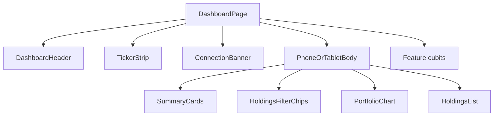

# Dashboard Screen

## Overview

Single assignment screen: header, live ticker tape, derived summary cards, filter chips, performance chart, and holdings. Phone stacks; tablet (≥ 840 logical px) splits summary/chart left and holdings right. Orientation is locked to `portraitUp` in `bootstrap` plus Android / iOS native config.

## Route

| Field | Value |
| ----- | ----- |
| Path | `/` |
| Name | `AppRoutes.dashboard` |

`MaterialApp.home` is `DashboardPage`.

## State Management

| Cubit | Reads | Notes |
| ----- | ----- | ----- |
| `ThemeCubit` | `watch` | Theme mode only |
| `ConnectionCubit` | `select` status | Header chip |
| `LivePricesCubit` | `select` per ticker | Tape chips and price cells |
| `HoldingsCubit` | `watch` book / `select` loaded | Summary + list; skeleton while `!loaded` |
| `HoldingsUiCubit` | `watch` | Search, sort, filter, expand |
| `ChartCubit` | `watch` | Historical series only |
| `TargetAlertEditCubit` | `watch` | Expanded-row draft |

## Composition

## Components Involved

| Component | File | Role |
| --------- | ---- | ---- |
| DashboardPage | `lib/src/features/portfolio/presentation/screens/dashboard_page.dart` | Watches cubits, hosts layout |
| ConnectionBanner | `lib/src/features/market/presentation/widgets/connection_banner.dart` | Reconnect / offline strip below the ticker tape |
| HoldingsFilterChips | `lib/src/features/portfolio/presentation/widgets/holdings_filter_chips.dart` | Horizontal filters; height from chips |
| HoldingsSection | `lib/src/features/portfolio/presentation/widgets/holdings_section.dart` | Search debounce + `AppEmptyState` when the filtered book is empty |
| SkeletonWrapper | `lib/src/shared/wrappers/skeleton_wrapper.dart` | `isLoading: true` until holdings load |
| AppTopBar | `lib/src/shared/widgets/app_top_bar.dart` | Reused header chrome |
| AppEmptyState / AppButton | `lib/src/shared/widgets/` | Empty filtered list; compact Save on target alert |

## Navigation

Single screen. No auth or onboarding routes.

## Change Impact

- [x] Reconnect / offline copy is a banner below the ticker tape
- [ ] Header copy and connection labels
- [x] Holdings list clears the system nav bar and sits above the keyboard
- [x] Tick isolation on tape and holdings (summary selects Equatable totals)
- [ ] Skeleton only while holdings `loaded` is false
- [x] Filter chips size to the `FilterChip` children (no fixed 40px height)
- [x] Dark-mode copy uses `onSurface` / `onSurfaceVariant` (not Google Fonts default ink or `outline`)
- [x] Target Price Alert matches Stitch drawer: pill badge, filled rupee field, compact `AppButton` Save
- [x] Filtered / searched empty book uses `AppEmptyState` + Show all
- [x] Holdings search is debounced (`AppDurations.quick`)
- [x] Page margin / list gaps use `AppSpacing.pagePadding` / `itemGap`; price flash uses `AppCurves.standard`
- [x] Orientation locked to `portraitUp` (`SystemChrome` + Android `screenOrientation` + iOS `UIInterfaceOrientationPortrait`)

## Related Flows

- [Feature: Portfolio](../../features/portfolio.md)
- [Feature: Market](../../features/market.md)
- [Data: price feed](../../data-flows/price-feed.md)
- [Data: derived metrics](../../data-flows/derived-metrics.md)
- [Data: composition](../../data-flows/composition.md)
- [Data: shared wrappers](../../data-flows/shared-wrappers.md)
- [Data: shared utils](../../data-flows/shared-utils.md)
- [Data: theme tokens](../../data-flows/theme-tokens.md)
