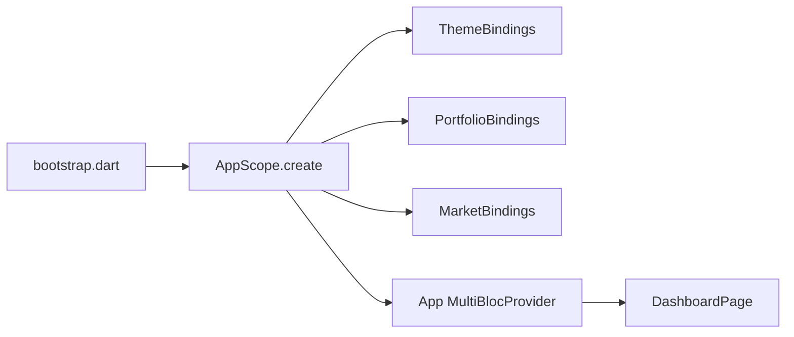

# App Composition

## Overview

Platform launch stays in `bootstrap.dart`. Repositories, the price feed, and root cubits are wired in `lib/src/di/` so adding a feature is a new binding plus one line in `AppScope` — not more inline construction. Widgets still read cubits with `context.watch` / `context.select` / `context.read`. There is no `get_it`.

## Prerequisites

- `Env.load`, `FlavorConfig.loadFromEnv`, `AppConfig.init`, and `StorageService.init` have run
- Feature folders stay isolated; only `lib/src/di/` imports more than one feature

## Flow Diagram

## Components Involved

| Component | File | Role |
| --------- | ---- | ---- |
| bootstrap | `lib/src/bootstrap.dart` | Binding, splash, env, orientation, `runApp` |
| AppScope | `lib/src/di/app_scope.dart` | Wires bindings; seed previous-closes → feed |
| ThemeBindings | `lib/src/di/theme_bindings.dart` | Prefs → `ThemeCubit` `initialMode` |
| PortfolioBindings | `lib/src/di/portfolio_bindings.dart` | Holdings, UI hydrate, chart, target-alert draft |
| MarketBindings | `lib/src/di/market_bindings.dart` | `PriceFeed`, `LivePricesCubit`, `ConnectionCubit` |
| App | `lib/src/app.dart` | `MultiBlocProvider(create:)` + `MaterialApp` |

## Steps

### Step 1: Platform

`bootstrap` initializes Flutter, localization, flavor env, Dio, and SharedPreferences. It does not construct cubits.

### Step 2: Bindings

`AppScope.create()` reads theme prefs, builds portfolio providers, then creates the feed from seed previous-closes. Each `BlocProvider` uses `create` so the tree closes cubits. `LivePricesCubit.close()` stops the feed.

### Step 3: Add a feature

1. Add `lib/src/di/<feature>_bindings.dart` with a `providers` field (not a rebuild-time getter).
2. Register it in `AppScope.create()`.
3. Keep cubits at the app root. Do not look them up from a locator.

## Change Impact

- [x] Root cubits use `BlocProvider(create:)` — not `.value`
- [x] Theme first frame uses persisted `initialMode` (no splash flash)
- [x] Holdings load + UI hydrate stay in portfolio bindings (not `DashboardPage`)
- [ ] Do not add `get_it` / `injectable`

## Related Flows

- [Data: shared wrappers](./shared-wrappers.md)
- [Data: shared services](./shared-services.md)
- [Data: price feed](./price-feed.md)
- [Screen: Dashboard](../component-flows/screens/dashboard.md)
