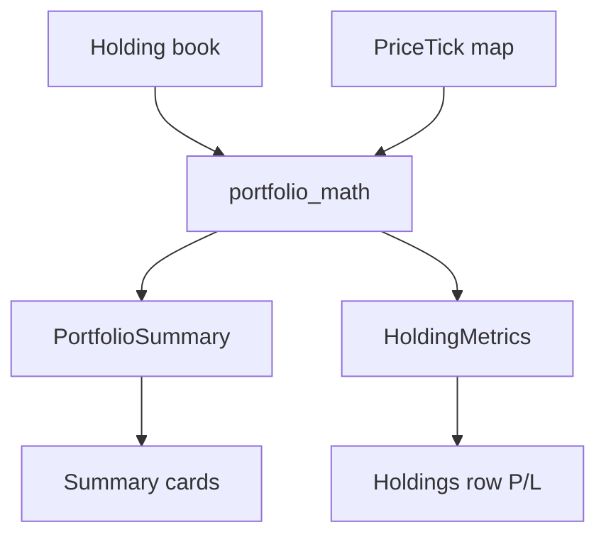

# Derived Metrics Data Flow

## Overview

P/L, P/L %, invested, current value, and today’s change are computed at read time from the holdings book plus the latest ticks. They are never stored on a cubit.

## Prerequisites

- `HoldingsCubit` has the book
- `LivePricesCubit` has zero or more ticks

## Flow Diagram

## Components Involved

| Component | File | Role |
| --------- | ---- | ---- |
| PortfolioMath | `lib/src/features/portfolio/domain/portfolio_math.dart` | Pure functions |
| HoldingsCubit | `lib/src/features/portfolio/presentation/cubit/holdings_cubit.dart` | Source book only |
| LivePricesCubit | `lib/src/features/market/presentation/cubit/live_prices_cubit.dart` | Latest prices only |

## Steps

### Step 1: Read

Widgets call `summarizePortfolio(holdings, ticks)` / `metricsFor(holding, tick)` inside `select` or a presentational build from already-selected inputs.

`SummaryCards` must `select` the Equatable `PortfolioSummary` (holding tickers only). Do not `select` a freshly allocated price `Map` — `Map ==` is identity, so tape extras would rebuild the grid.

### Step 2: Missing tick

`currentValue` falls back to `qty × avgBuy`. Today’s change is 0 when price equals previous close or no tick exists and previous close is used as the live fallback only for value, not for fabricating a move.

## Change Impact

- [x] Summary cards `select` Equatable `PortfolioSummary` (tape ticks do not rebuild)
- [ ] Holdings P/L cells
- [ ] Filter chips that depend on derived profit/loss/movers

## Related Flows

- [Feature: Portfolio](../features/portfolio.md)
- [Screen: Dashboard](../component-flows/screens/dashboard.md)
