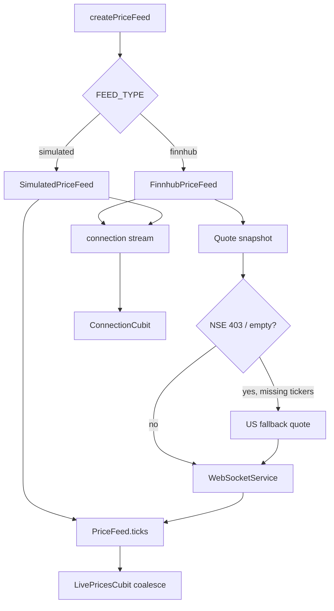

# Price Feed Data Flow

## Overview

How ticks and connection state move from a flavor-selected `PriceFeed` into `LivePricesCubit` / `ConnectionCubit`. On reconnect the feed refetches a quote snapshot before opening a new socket. Finnhub free plans return **403** for NSE symbols; the snapshot retries only the missing tickers with US fallbacks, then subscribes to whichever symbol succeeded.

## Prerequisites

- `FlavorConfig` loaded from `.env.<flavor>`
- Run config **dev** → `lib/main_dev.dart`, **beta** → `lib/main_qa.dart` (QA), **prod** → `lib/main_prod.dart`
- Holdings tickers known so the feed can subscribe

## Flow Diagram

## Components Involved

| Component | File | Role |
| --------- | ---- | ---- |
| createPriceFeed | `lib/src/features/market/data/create_price_feed.dart` | Flavor factory |
| SimulatedPriceFeed | `lib/src/features/market/data/feeds/simulated_price_feed.dart` | Dev/QA ticks + drop/restore |
| FinnhubPriceFeed | `lib/src/features/market/data/feeds/finnhub_price_feed.dart` | Prod snapshot + WS; per-ticker US fallback on 403 |
| QuoteRemoteDataSource | `lib/src/features/market/data/datasources/quote_remote_data_source.dart` | HTTP `/quote`; omits denied symbols |
| WebSocketService | `lib/src/features/market/data/services/web_socket_service.dart` | Backoff reconnect |

## Steps

### Step 1: Start

Composition root calls `feed.start(tickers)` after holdings load. The first socket open runs `onBeforeConnect`, which snapshots quotes. NSE symbols that 403 are retried with `kFinnhubFallbackSymbols`; the socket then subscribes to the symbols that returned data.

### Step 2: Disconnect

Service emits `reconnecting`, waits with jittered backoff, runs `onBeforeConnect` snapshot, opens a new socket, resubscribes, emits `live`.

### Step 3: Kill socket (dev)

`feed.killForDemo()` drops the stream so Requirement 6 is demoable without airplane mode.

## Change Impact

- [ ] Connection chip labels
- [ ] Snapshot-on-reconnect (never silent resume)
- [ ] NSE 403 retries US fallbacks per ticker (do not abort when INFY succeeds)
- [ ] Flavor WS URL / backoff knobs
- [ ] Run configs: `dev` / `beta` / `prod` entry points

## Related Flows

- [Feature: Market](../features/market.md)
- [Screen: Dashboard](../component-flows/screens/dashboard.md)
- [Data: shared services](./shared-services.md)
