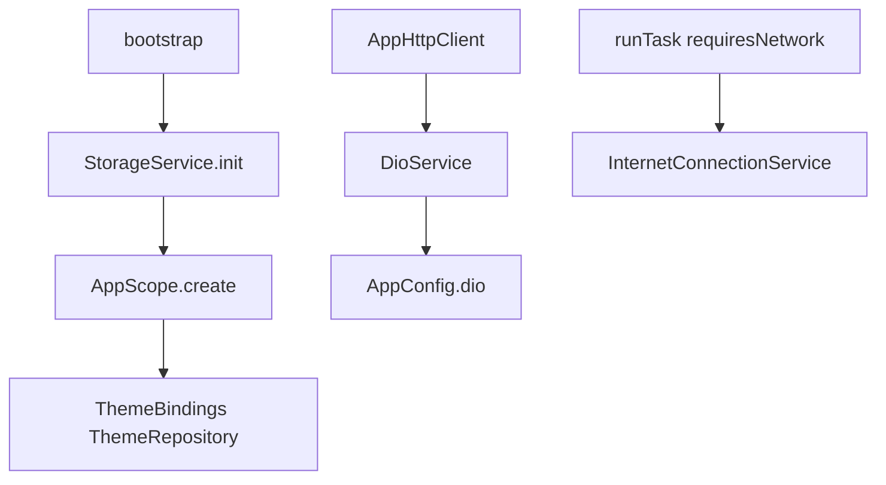

# Shared Services Data Flow

## Overview

`lib/src/services/` holds only the three wrappers the app uses: SharedPreferences, Dio, and the connectivity check behind `runTask`. Auth, clipboard, secure storage, and permission helpers were unused and removed.

## Prerequisites

- `StorageService.instance.init()` during bootstrap
- `AppConfig.dio` configured before quote HTTP
- Network check only when `runTask(..., requiresNetwork: true)`

## Flow Diagram

## Components Involved

| Component | File | Role |
| --------- | ---- | ---- |
| StorageService | `lib/src/services/storage_service.dart` | Theme mode prefs |
| DioService | `lib/src/services/dio_service.dart` | HTTP verbs + `runTask` |
| InternetConnectionService | `lib/src/services/internet_connection_service.dart` | Pre-flight network check |
| AppHttpClient | `lib/src/config/app_http_client.dart` | Quote client over DioService |

## Steps

### Step 1: Persist theme

Bootstrap initializes `StorageService`. `ThemeBindings` then reads the mode key so `ThemeCubit` can start with `initialMode` before the first frame.

### Step 2: Fetch quotes

`AppHttpClient` delegates to `DioService`, which wraps `AppConfig.dio` and maps errors through `runTask`. Quote GETs set `allowClientError` so a Finnhub 403 is a response the feed can fallback from, not a thrown `DioException`.

### Step 3: Gate networked tasks

When `requiresNetwork` is true, `runTask` asks `InternetConnectionService` before calling the action and returns `NetworkFailure` if offline. It does not toast. Reconnect / offline copy lives in `ConnectionBanner` below the ticker tape.

## Change Impact

- [ ] Theme persistence still uses SharedPreferences only
- [ ] Quote HTTP still goes through `AppHttpClient` / `DioService`
- [ ] Do not re-add Auth / Copy / SecureStorage / Permission services
- [x] Theme prefs are read in `ThemeBindings`, not inline in `bootstrap`

## Related Flows

- [Data: price feed](./price-feed.md)
- [Data: composition](./composition.md)
- [Data: shared wrappers](./shared-wrappers.md)
- [Data: shared utils](./shared-utils.md)
- [Feature: Market](../features/market.md)
