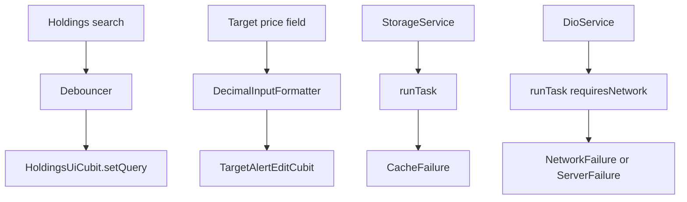

# Shared Utils Data Flow

## Overview

`lib/src/utils/` holds the leftovers the dashboard actually uses: `runTask` / `Failure`, `AppLogger`, `Debouncer`, and `DecimalInputFormatter`. Credit-card formatters, OS `PlatformInfo`, and unused `AppUtils` validators were removed.

## Prerequisites

- `StorageService.init()` during bootstrap (maps errors to `CacheFailure`)
- Quote HTTP goes through `DioService` → `runTask(..., requiresNetwork: true)`

## Flow Diagram

## Components Involved

| Component | File | Role |
| --------- | ---- | ---- |
| Debouncer | `lib/src/utils/debouncer.dart` | Coalesces holdings search keystrokes |
| DecimalInputFormatter | `lib/src/utils/input_formatters.dart` | Numeric target-price draft |
| runTask | `lib/src/utils/task_runner.dart` | Either + Failure mapping |
| CacheFailure | `lib/src/utils/failure.dart` | Local prefs / non-network errors |
| AppLogger | `lib/src/utils/logger.dart` | Debug logs only |

## Steps

### Step 1: Search

`HoldingsSection` waits `AppDurations.quick` after the last keystroke, then calls `HoldingsUiCubit.setQuery`. A live tick does not reset the query.

### Step 2: Target price

The alert field applies `DecimalInputFormatter` and saves through snapshot-and-diff. `hideKeyboard()` runs on save.

### Step 3: Failures

Networked `runTask` returns `NetworkFailure` when offline and `ServerFailure` on transport errors. Local work (prefs) returns `CacheFailure`.

## Change Impact

- [ ] Do not re-add `AppUtils`, `PlatformInfo`, or card-number formatters
- [ ] Search debounce must not reset on a price tick
- [ ] Target-alert save still skips the repository when the value is unchanged

## Related Flows

- [Screen: Dashboard](../component-flows/screens/dashboard.md)
- [Data: shared services](./shared-services.md)
- [Feature: Portfolio](../features/portfolio.md)
