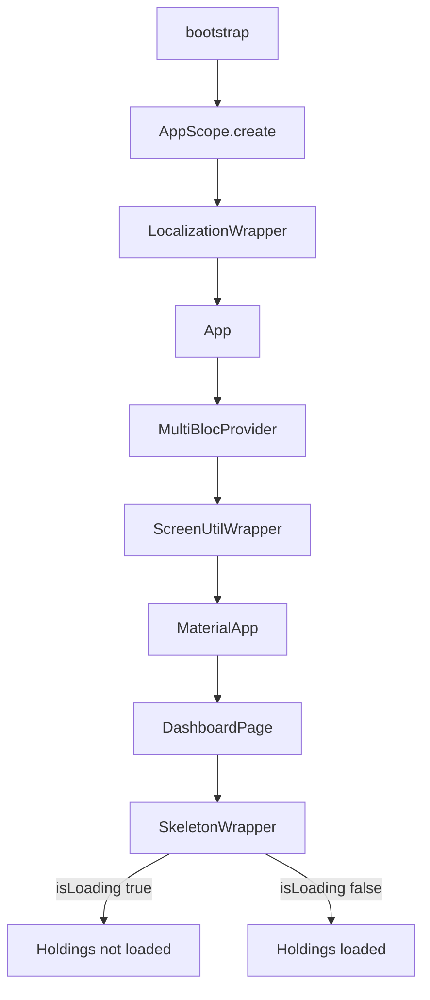

# Shared Wrappers Data Flow

## Overview

`lib/src/shared/wrappers/` holds the app-root widgets: `EasyLocalization`, `ScreenUtilInit`, and `Skeletonizer`. `StateWrapper` was an unused identity widget and stays removed. `SkeletonWrapper` receives `isLoading: true` until `HoldingsCubit` marks the book loaded.

## Prerequisites

- `EasyLocalization.ensureInitialized()` before `runApp`
- `ScreenUtilWrapper` around `MaterialApp` (design size 360×690)
- `HoldingsCubit` provided above `DashboardPage` via `AppScope`

## Flow Diagram

## Components Involved

| Component | File | Role |
| --------- | ---- | ---- |
| LocalizationWrapper | `lib/src/shared/wrappers/localization_wrapper.dart` | `EasyLocalization` + `en` |
| ScreenUtilWrapper | `lib/src/shared/wrappers/screen_util_wrapper.dart` | `ScreenUtilInit` 360×690 |
| SkeletonWrapper | `lib/src/shared/wrappers/skeleton_wrapper.dart` | Bones while holdings load |
| App | `lib/src/app.dart` | Hosts `scope.providers`, theme, dashboard home |
| AppScope | `lib/src/di/app_scope.dart` | Feature bindings + root `BlocProvider(create:)` list |
| DashboardPage | `lib/src/features/portfolio/presentation/screens/dashboard_page.dart` | Passes `isLoading: !loaded` |

## Steps

### Step 1: Localize

`bootstrap` wraps `runApp` in `LocalizationWrapper` so `MaterialApp` can read `context.locale`. Cubits come from `App(scope:)`.

### Step 2: Scale

`App` wraps `MaterialApp` in `ScreenUtilWrapper`. Do not add a second `ScreenUtilInit`.

### Step 3: Skeleton

`DashboardPage` selects `!HoldingsCubit.state.loaded` and passes that as `SkeletonWrapper.isLoading`. `PortfolioBindings` starts `load()` from `create` without blocking `runApp` so the first frames are skeletonized. Ticks do not flip `loaded`.

## Change Impact

- [ ] Do not re-add `StateWrapper`
- [ ] Screen scaling stays 360×690 via `ScreenUtilWrapper`
- [ ] Dashboard copy still goes through `easy_localization`
- [ ] Skeleton only while holdings are unloaded — not on price ticks
- [x] Root cubits are created by `AppScope` / `App`, not inline in `bootstrap`

## Related Flows

- [Screen: Dashboard](../component-flows/screens/dashboard.md)
- [Data: composition](./composition.md)
- [Data: shared services](./shared-services.md)
- [Data: theme tokens](./theme-tokens.md)
