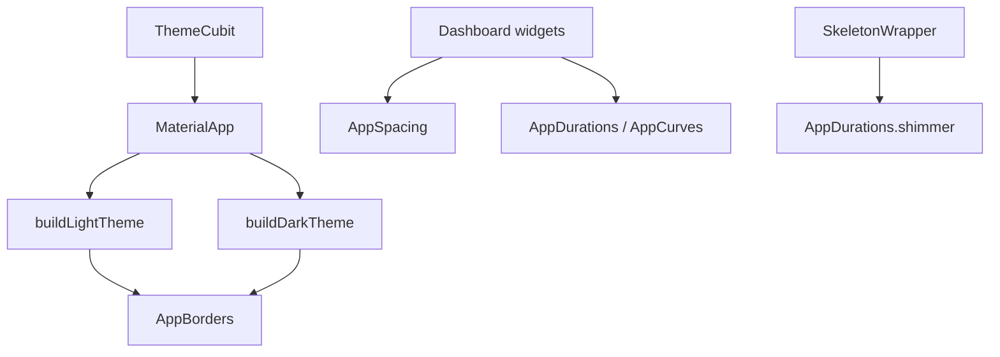

# Theme Tokens Data Flow

## Overview

`lib/src/theme/` is the Stitch token source: Material `ColorScheme`, type, spacing, radii, and motion. Drop-shadow tokens (`AppShadows`) and the unused `AppDesignTokens` / Cupertino builders were removed — depth is outline edges, and chrome radii come from `AppBorders`.

## Prerequisites

- `ScreenUtilWrapper` around `MaterialApp` (spacing uses `.r`)
- `ThemeCubit` chooses `buildLightTheme` / `buildDarkTheme`

## Flow Diagram

## Components Involved

| Component | File | Role |
| --------- | ---- | ---- |
| ThemeData | `lib/src/theme/theme.dart` | Light / dark Material chrome |
| AppSpacing | `lib/src/theme/app_spacing.dart` | Gaps; `pagePadding` / `itemGap` / `cardPadding` |
| AppBorders | `lib/src/theme/app_borders.dart` | Radii on widgets and ThemeData |
| AppDurations | `lib/src/theme/app_durations.dart` | Price flash, search debounce, shimmer |
| AppCurves | `lib/src/theme/app_curves.dart` | Price flash + button loader |
| Color / type | `lib/src/theme/color_schemes.dart`, `text_theme.dart` | Navy / yield / loss + fonts |

## Steps

### Step 1: Apply theme

`App` watches `ThemeCubit` and sets `theme` / `darkTheme` / `themeMode`. Widgets read `context.colors` and `context.appColors`.

### Step 2: Layout tokens

Dashboard page margin is `AppSpacing.pagePadding`. Tight list / grid gaps are `AppSpacing.itemGap`. Cards use `AppBorders.card` and 1px `outlineVariant`.

### Step 3: Motion

Price cells and tape chips flash for `AppDurations.priceFlash` with `AppCurves.standard`. Skeleton uses `AppDurations.shimmer`.

## Change Impact

- [ ] Do not re-add drop-shadow tokens or a Cupertino theme
- [ ] Do not hardcode hex in widgets — add a ColorScheme / AppColors token first
- [ ] Price flash stays 260–400ms on only the cell that moved

## Related Flows

- [Screen: Dashboard](../component-flows/screens/dashboard.md)
- [Data: shared wrappers](./shared-wrappers.md)
- [Feature: Portfolio](../features/portfolio.md)
