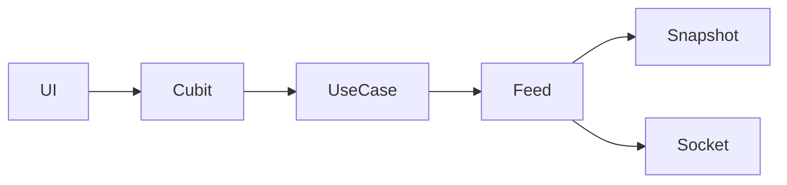

# Market Feature

## Overview

Owns live price ticks, quote snapshots, WebSocket / simulated feeds, and connection status. Flavors choose the feed implementation; domain only sees `PriceFeed`.

## Domain Boundaries

- **In scope:** `PriceTick`, `PriceFeed`, watch/snapshot use cases, connection status stream
- **Out of scope:** holdings book, P/L math, theme, chart history

## Public Use Cases

| Use Case | Description |
| -------- | ----------- |
| `WatchPrices` | Subscribe to tick + connection streams |
| `FetchQuoteSnapshot` | HTTP (or simulated) snapshot before (re)subscribe |

## Repository Contracts

| Contract | Methods |
| -------- | ------- |
| `PriceFeed` | `ticks`, `connection`, `start`, `stop`, `killForDemo` |

## Architecture

## Components Involved

| Component | File | Role |
| --------- | ---- | ---- |
| LivePricesCubit | `lib/src/features/market/presentation/cubit/live_prices_cubit.dart` | Coalesced ticker → tick map |
| ConnectionCubit | `lib/src/features/market/presentation/cubit/connection_cubit.dart` | Live / Reconnecting… / Offline |
| ConnectionBanner | `lib/src/features/market/presentation/widgets/connection_banner.dart` | Reconnect / offline strip below the ticker tape |
| PriceFeed | `lib/src/features/market/domain/repositories/price_feed.dart` | Domain feed contract |
| createPriceFeed | `lib/src/features/market/data/create_price_feed.dart` | Flavor factory |

## Dependencies

- `AppHttpClient` / Dio for quotes
- `web_socket_channel` only inside `data/`
- `FlavorConfig` for URL, feed type, backoff knobs

## Tests

| Area | Path |
| ---- | ---- |
| Cubits | `test/features/market/presentation/cubit/` |
| Feeds | `test/features/market/data/` (`finnhub_price_feed_test.dart`, `quote_remote_data_source_test.dart`) |
| Fakes | `test/support/fake_price_feed.dart`, `test/support/fake_app_http_client.dart` |

## Change Impact

- [ ] Connection chip copy
- [ ] Ticker strip rebuild isolation
- [ ] Reconnect snapshot-then-subscribe
- [ ] Quote 403 on NSE does not skip US fallbacks

## Related Flows

- [Data: price feed](../data-flows/price-feed.md)
- [Feature: Portfolio](./portfolio.md)
- [Screen: Dashboard](../component-flows/screens/dashboard.md)
