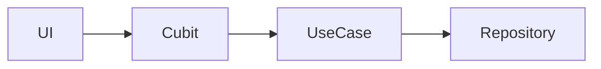

# Portfolio Feature

## Overview

Owns the mock holdings book, derived portfolio math, summary cards, holdings list/table, target-price alerts, and the historical performance chart. Presentation talks to cubits and domain contracts only.

## Domain Boundaries

- **In scope:** holdings entities, portfolio math, holdings/chart repositories, target-alert updates, dashboard composition
- **Out of scope:** WebSocket transport, quote HTTP, connection chip transport state (`market`)

## Public Use Cases

| Use Case | Description |
| -------- | ----------- |
| `LoadHoldings` | Returns the mock book (qty, avg buy, previous close, saved alerts) |
| `UpdateTargetAlert` | Snapshot-and-diff write of a per-ticker target price |

## Repository Contracts

| Repository | Methods |
| ---------- | ------- |
| `HoldingsRepository` | `load()`, `updateTargetAlert(ticker, value)` |
| `ChartRepository` | `series()` — 10-day NAV ledger, not live ticks |

## Architecture

## Components Involved

| Component | File | Role |
| --------- | ---- | ---- |
| DashboardPage | `lib/src/features/portfolio/presentation/screens/dashboard_page.dart` | Composition root screen |
| HoldingsCubit | `lib/src/features/portfolio/presentation/cubit/holdings_cubit.dart` | Static book + saved alerts |
| HoldingsUiCubit | `lib/src/features/portfolio/presentation/cubit/holdings_ui_cubit.dart` | Search, sort, filter, expanded row |
| ChartCubit | `lib/src/features/portfolio/presentation/cubit/chart_cubit.dart` | Historical window only |
| TargetAlertEditCubit | `lib/src/features/portfolio/presentation/cubit/target_alert_edit_cubit.dart` | Snapshot-and-diff draft |
| PortfolioMath | `lib/src/features/portfolio/domain/portfolio_math.dart` | Derived P/L at read time |

## Dependencies

- `lib/src/shared/`, `lib/src/theme/`, `lib/src/core/`
- `market` via public cubits (`LivePricesCubit`, `ConnectionCubit`) at composition time — no imports of `market/data`

## Tests

| Area | Path |
| ---- | ---- |
| Math / use cases | `test/features/portfolio/domain/` |
| Cubits | `test/features/portfolio/presentation/cubit/` |
| Widgets | `test/features/portfolio/presentation/widgets/` |
| Repository | `test/features/portfolio/data/` |

## Change Impact

- [x] Dashboard holdings inset for keyboard + system nav bar
- [x] Derived summary selects Equatable totals (tape ticks do not rebuild cards)
- [ ] Target-alert persistence (in-memory only)
- [x] Target Price Alert UI matches Stitch drawer chrome
- [x] Empty filtered holdings use `AppEmptyState` (Show all resets search + filter)
- [ ] Dashboard `SkeletonWrapper` while holdings are unloaded
- [x] Dashboard orientation locked to `portraitUp`

## Related Flows

- [Screen: Dashboard](../component-flows/screens/dashboard.md)
- [Data: derived metrics](../data-flows/derived-metrics.md)
- [Data: shared utils](../data-flows/shared-utils.md)
- [Feature: Market](./market.md)
